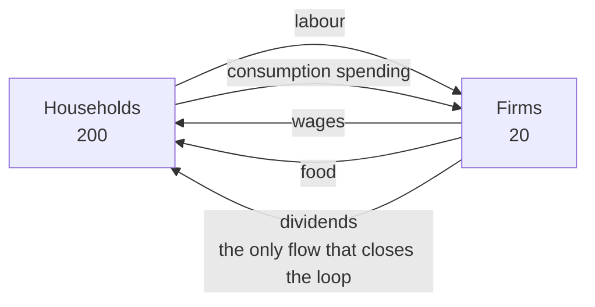
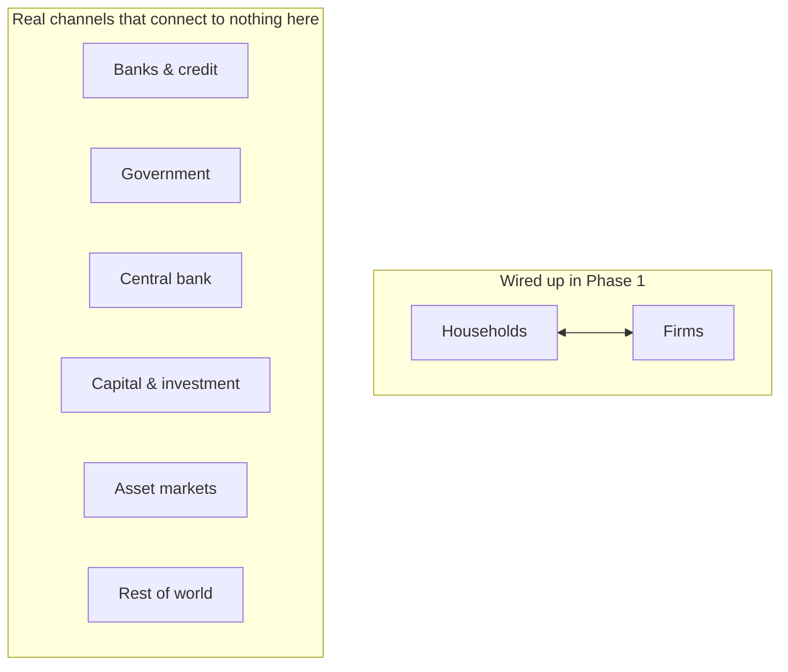

# Realism: what this simulation shows, and what it leaves out

**Scope:** the Phase 1 build only — 200 households, 20 firms, one good, fixed money stock.

> **Nothing here is measured output.** The simulation has not been written yet. Real-world
> figures are approximate and cited for shape rather than precision.
>
> A visual version of this document, with the circular-flow diagram and diagnostic
> silhouettes drawn out, is published at
> <https://claude.ai/code/artifact/1c632f43-e493-4fa0-9c27-5bc8f595e27f>

---

## 1. What "realistic" means for a model like this

The bar is **not forecasting**. Nobody uses an agent-based model of this class to predict next
quarter's GDP. These models are judged against **stylized facts** — robust qualitative
regularities that appear in real data across countries and decades. A model passes if it
reproduces the regularity *without being told to*.

That changes how you read your own output:

- Your unemployment sitting near 7% when the real US average is nearer 5.8% is **not a failure**.
- Your unemployment sitting perfectly flat, or output fluctuations alternating randomly instead
  of clustering into good and bad stretches, **is**.

The strongest claim this sim can make is structural: **it produces business cycles with no
external shocks at all.** There is no shock generator, no random productivity disturbance, no
policy surprise. Fluctuation arises purely from agents deciding on incomplete information and
mistiming each other. Much of mainstream macro needs exogenous shocks to generate cycles.
Yours has none.

---

## 2. The circuit you're building

Two things about the wired-up part:

1. **Money only ever circulates.** It is never created or destroyed — there is no bank to lend
   it into existence and no government to spend it into existence.
2. **The dividend arrow does enormous work.** In a real economy firm profits reach households
   through wages, share ownership, pension funds and bank deposits. Here there is exactly one
   path, and if it breaks the economy suffocates.

### What connects to nothing

Every one of those is a mechanism that drives real macroeconomic behaviour — and six of the ten
items on the project's own future roadmap are exactly these boxes.

---

## 3. What you should see

Nine regularities that should emerge without being programmed in. This is the realism checklist.

| Phenomenon | Why it emerges | Real-world analogue | Confidence |
|---|---|---|---|
| **Involuntary unemployment** | Search friction — job seekers see only 5 firms, so vacancies and jobless people coexist | US unemployment has ranged roughly 3.5–10% across recent cycles; never zero even in booms | Expected |
| **Price dispersion** | Bounded search — no household sees all 20 prices, so one good sustains many prices | Identical goods demonstrably sell at different prices in the same market at the same time | Expected |
| **Endogenous business cycles** | Interaction and mistimed decisions alone; there is no shock generator | Output growth is strongly autocorrelated; expansions and recessions cluster | Expected |
| **Beveridge curve** | Vacancies and unemployment are two sides of one matching process | Negative vacancy–unemployment relation; among the most robust facts in labour economics | Expected |
| **Skewed firm sizes** | Cumulative advantage — a firm that sells more hires more, which lets it sell more | Real firm-size distributions are heavily right-skewed, close to a power law | Expected |
| **Clustered bankruptcies** | Firms face correlated demand, so they fail at the same time | Business failures spike in downturns rather than arriving at a steady rate | Expected |
| **Phillips-type relation** | Tight labour markets force firms to bid wages up | Negative unemployment–wage-inflation relation — real but empirically unstable | Possible |
| **Okun-type relation** | Output is a direct function of headcount | Rule of thumb near 2pp of output per point of unemployment | Weak test |
| **Wealth inequality** | Employment history compounds; dividend income is concentrated | Real wealth is highly concentrated everywhere it is measured | Overstated |

**On Okun's law:** "weak test" is honest rather than pessimistic. With one good and no capital,
output is *defined* as headcount × productivity, so the relation is closer to an identity than
an emergent finding. Reproducing it proves very little.

---

## 4. Reading the diagnostics

Two acceptance criteria are about **shape**, not value.

**Unemployment**

| Shape | Reading |
|---|---|
| Wanders in a band, never touching either rail | Alive |
| Collapses to zero and stays | Reservation wages decayed too fast, or vacancies always exceed seekers |
| Climbs to 100% and stays | Usually the deflationary stall — firms have no cash to make payroll |

**Price level**

| Shape | Reading |
|---|---|
| Fluctuates around a level with visible dispersion between firms | Alive |
| Grinds toward the floor | Check for missing dividends *before* blaming the price rule |
| Climbs without limit | Broken ceiling, or a wage–price feedback with no brake |

> **The trap.** A price series can look *admirably stable* and be completely dead. If most firms
> sit on the price floor they all charge nearly the same thing — "buy from the cheapest of 5"
> becomes a coin flip, search friction stops doing anything, and the market quietly degenerates
> while the chart looks perfect. This is why `fraction_at_floor` is logged every tick.

---

## 5. What you won't see

None of these are bugs or oversights. Every one is deliberately out of scope, and most are on
the roadmap.

### The two that change everything

| Absence | Consequence |
|---|---|
| **No growth** — productivity fixed at 3 units/worker/day forever; no technology, no capital accumulation, no learning | The economy is **stationary by construction**. Ten simulated years produce zero long-run growth, against roughly 2%/year for real advanced economies. You are modelling fluctuation around a flat trend, not development. |
| **No credit** — no banks, lending, debt, interest, leverage, or default beyond running out of cash | You cannot produce a financial crisis, credit crunch, debt-deflation spiral or balance-sheet recession. Since most severe real recessions involve credit, this is the **largest single gap** between the sim and the events macroeconomics most wants to explain. |

### Absent policy and structure

| Absence | Consequence |
|---|---|
| **Monetary policy** — no central bank, interest rate, or money creation | Inflation cannot be a monetary phenomenon here. Price-level drift comes only from how fast money changes hands and where it pools. |
| **Fiscal policy** — no taxes, spending, benefits or transfers | Nothing cushions a downturn. Real recessions are damped by automatic stabilisers; yours run to their natural conclusion, making downturns sharper than reality. |
| **Investment** — no capital stock, nothing to depreciate | Loses the most volatile component of real GDP. Much of the amplitude of actual cycles comes from investment swinging harder than consumption. |
| **Relative prices** — one good, so no substitution, sectoral shifts, supply chains or input–output structure | Exactly one price to watch. Real economies transmit shocks *between* sectors through relative prices; that channel is missing. |
| **Asset markets** — no equity trading, housing, or asset prices; firms are owned but never valued | No bubbles, no crashes, no wealth effects on spending. |
| **Foreign sector** — closed economy | No external demand shocks, no trade balance. |
| **Demographics** — the same 200 households on day 1 and day 3,650 | Labour force is constant. No participation dynamics, inheritance, or cohort effects. |
| **Worker heterogeneity** — all workers identical; employment is binary | No skill premium, human capital, mismatch, or short-time working. Real firms cut hours before heads. |
| **Forward-looking expectations** — agents extrapolate from what just happened | No confidence effects, self-fulfilling expectations, or announcement effects — a large part of modern macro. |

---

## 6. Present, but not like reality

Subtler than the absences, and easier to misread as findings.

| Distortion | Why it differs from reality |
|---|---|
| **Inequality is overstated** — 20 of 200 households receive *all* dividend income | All three reference papers pay dividends across the whole population pro-rata to wealth. Single-owner firms are this project's own deviation (the seed of the later stock market). Expect a more extreme wealth distribution than any published model reports — and don't read it as a finding about real inequality. |
| **Saving is pure hoarding** — unspent money sits as idle cash | With no banks, savings are never intermediated into anyone else's spending. In reality saving funds investment. Here it is a pure leak from the circular flow, biasing the economy toward deflation. |
| **Firm count is held constant** — every bankruptcy triggers immediate replacement | A Phase 1 scaffold, not a behaviour. Real entry responds to profitability and lags exit, so concentration shifts over a cycle. Yours cannot. |
| **Consumption is the whole economy** — food is the only good | Household consumption is a large share of real GDP but far from all of it. Investment, government and net exports are unrepresented. |
| **Twenty firms is very few** — one firm is 5% of the economy | Aggregate series will be far noisier than real data, and inequality measures over 20 firms are statistically fragile. Whether the published calibration even survives at this scale is an open question flagged for Phase 11. |
| **A day is not a day** — firms replan monthly, households shop daily, wages are indefinite | Real decision cadences are wildly heterogeneous; some prices change by the second, some contracts last years. The model compresses all of it into two clocks. |

---

## 7. How to actually compare it to real data

**Aggregate before you compare.** The sim emits one row per simulated day; real macro data is
monthly or quarterly. Comparing daily to quarterly manufactures volatility that isn't there.
Aggregate to the model's own 21-day month, then to three-month quarters. Discard the burn-in
first.

**Compare shapes and signs, never levels.** The question is *"does unemployment fall when
vacancies rise, and by a plausible ratio"* — not *"is unemployment 5.8%"*. The price level is
denominated in a currency that doesn't exist, the money stock is a free parameter that was
chosen, and the economy has 200 people in it. Levels were never meant to be comparable.

**Know which relationships are real tests.** The Beveridge curve is genuine — it emerges from
matching and could easily fail. Okun's law is nearly an identity here. Being clear about which
is which stops you congratulating yourself on arithmetic.

**Where the real series live.** Unemployment and real GDP from FRED; vacancy data from the JOLTS
survey for the Beveridge curve; firm-size distributions from Census business-dynamics
statistics. All free. Use them for *shape* — the slope of a scatter, the decay of an
autocorrelation function — not their numbers.

> **One caution on validation.** Reproducing a stylized fact is weaker evidence than it feels.
> Many quite different models generate the same handful of regularities, so matching them does
> not single yours out as correct. It establishes that the economy is not obviously broken —
> which, for a foundation whose entire purpose is to be correct before it is interesting, is
> exactly the right bar.
